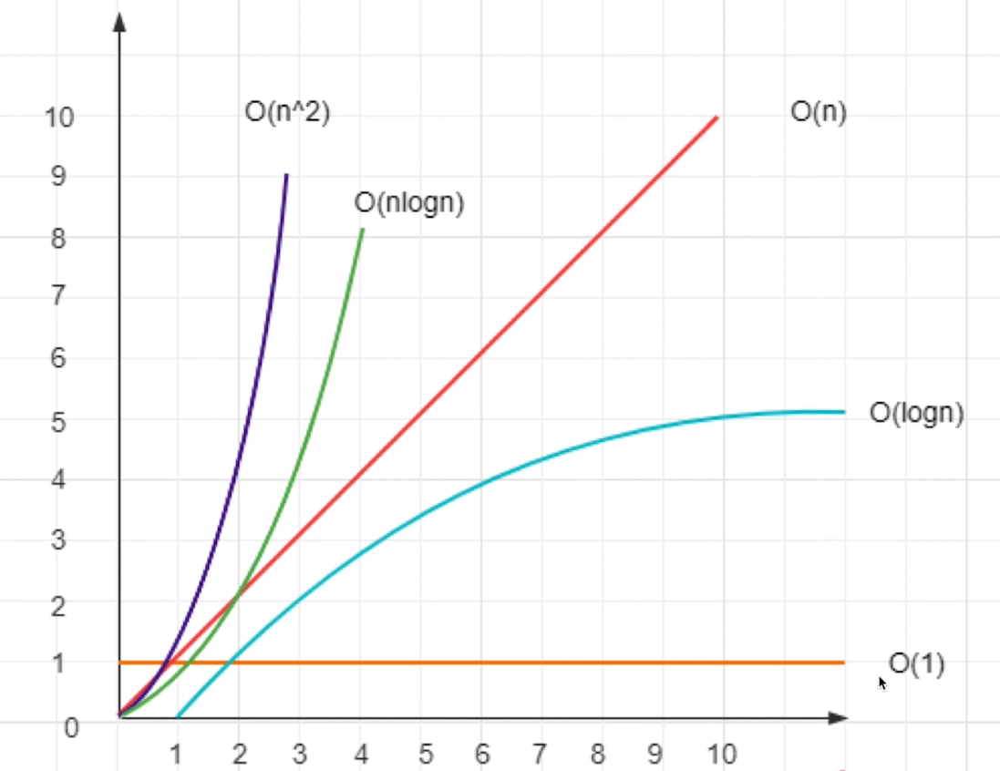

# 什么是复杂度
- 程序执行时需要的计算量和内存空间（和代码是否简洁无关）
- 复杂度是**数量级**（方便记忆、推广），不是具体的数字，用O(表达式)表示
- 一般针对一个具体的算法，而非一个完整的系统

# 常见复杂度
- O(1): 一次就够，次数是可数的/有限的、可数的空间（数量级）
- O(logn)：数据量的对数，二分（数量级）
- O(n)：和传输的数据量一样/和输入量相同的空间（数量级）
- O(nlogn)：数据量*数据量的对数（数量级）
- O(n^2)：数据量的平方（数量级）

# 为什么必须掌握算法复杂度
- 如果没有复杂度的概念和敏感度，写出的程序会有危险
- 例如，代码功能测试正常，数据量一大，程序就奔溃
- 对于前端，尤其时间复杂度

## - 如果复杂度到了O(n^2)，算法基本不可用！
## - 尽量控制算法在O(n)内