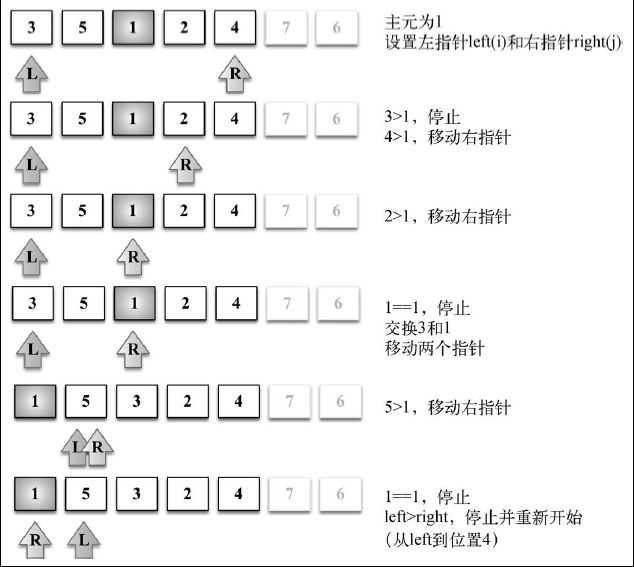

## 快速排序：和归并排序一样，也使用了分而治之的方法，将原始数组分为较小的数组（但它没有像归并排序那样将它们分割开）
## 时间复杂度O(nlog(n))，是特别常用的排序算法

### (1) 首先，从数组中选择一个值作为主元（pivot），也就是数组中间的那个值。
### (2) 创建两个指针（引用），左边一个指向数组第一个值，右边一个指向数组最后一个值。移
### 动左指针直到我们找到一个比主元大的值，接着，移动右指针直到找到一个比主元小的值，然后交换它们，重复这个过程，直到左指针超过了右指针。这个过程将使得比主元小的值都排在主元之前，而比主元大的值都排在主元之后。这一步叫作划分（partition）操作。
### (3) 接着，算法对划分后的小数组（较主元小的值组成的子数组，以及较主元大的值组成的子数组）重复之前的两个步骤，直至数组已完全排序。

### 第一件要做的事情是选择主元，有好几种方式。最简单的一种是选择数组的第一个值（最左边的值）。然而，研究表明对于几乎已排序的数组，这不是一个好的选择，它将导致该算法的最差表现。另外一种方式是随机选择数组的一个值或是选择中间的值。

#### 让我们来一步步地看一个快速排序的实际例子。

#### 给定数组[3, 5, 1, 6, 4, 7, 2]，前面的示意图展示了划分操作的第一次执行。
#### 下面的示意图展示了对有较小值的子数组执行的划分操作（注意7 和6 不包含在子数组之内）。

#### 接着，我们继续创建子数组，如下图所示，但是这次操作是针对上图中有较大值的子数组（有1的那个较小子数组不用再划分了，因为它仅含有一个值）。

#### 对子数组[2, 3, 5, 4]中的较小子数组[2, 3]继续进行划分。

#### 然后子数组[2, 3, 5, 4]中的较大子数组[5, 4]也继续进行划分，示意图如下。

#### 最终，较大子数组[6, 7]也会进行划分操作，快速排序算法的操作执行完成。